## 相机列表页面

当相机连接到电脑后，3DViewer将自动监控可连接相机，将相机的序列号显示在如下图红色框内，若是网络设备，在序列号后面携带设备的IP地址。将鼠标指针悬浮在相机列表项上，相机序列号显示为高亮，若相机没有连接，在序列号右边显示“Connect”标记；若相机已经连接，在序列号右边显示“Disconnect”标记。

- ### 连接相机

  3DViewer同一时刻仅支持连接单个相机，在相机列表中找到相机序列号，然后单击鼠标左键，等待相机连接成功，若之前已经连接了其他的相机，连接新相机前，会先断开已经连接的相机，然后再连接新相机，连接成功后，序列号前面显示“✔”图标。

- ### 断开相机

  若需要断开已经连接的相机，只需要鼠标左键点击已经连接的相机列表项。

## 启动/停止预览

#### 启动预览

启动预览前，需要先连接相机（如何连接相机请查看：[连接相机](#1)），连接好相机后，在参数设置的格式与分辨率设置中，选择需要的数据格式和分辨率，然后点击下图标记2处的启动预览按钮，等待启动完成后，将在窗口右侧看到图像和点云窗口。

#### 停止预览

停止预览在启动预览后才生效，点击如下图标记2的停止预览按钮，可停止当前预览，停止预览后不会断开相机连接，不能设置相机相关的参数，但是可以设置深度相机和RGB相机数据格式和分辨率大小。

## 暂停/恢复预览

启动预览后，可以点击如下图标记1处的按钮进入暂停预览状态，此状态下不会更新新的数据；在暂停预览状态下，再次点击该按钮，恢复到预览状态，将持续更新相机数据。

## 设置相机参数

相机参数设置页面如下图红框所示，在整个窗口的左侧，分为深度相机参数和RGB相机参数（若设备不存在RGB相机，“RGB Camera”按钮显示为灰色不可点击状态），在参数设置页面，可以通过调节曝光时间、增益、深度范围，白平衡等参数对相机完成不同设置，然后在右侧图像显示区域查看不同设置下的图像效果。

### 深度相机参数

深度相机各个参数设置会影响深度图、IR（红外）图、点云图，不影响RGB图，各个参数设置介绍如下：

- Stream Format（格式）：深度相机流格式分为Z16，Z16Y8Y8，Pair三种，预览模式不能切换流格式，只有在停止流或者暂停流状态下才能切换；

- Resolution（分辨率）：分辨率的大小，决定图像显示比例，与流格式一起决定一帧深度数据的大小；
- Depth Range（深度范围）：以mm（毫米）为单位，决定相机的可视范围，只有在深度范围距离内的物体才能被相机捕获到；

- Auto Exposure（自动曝光）：自动曝光默认是关闭的，打开自动曝光后，曝光时间和增益由相机系统自动设置，3DViewer不能手动设置曝光时间和增益，深度自动曝光有Speed First（速度优先）、Quality First（质量优先）、Foreground（前景优先）三种模式，具有如下特点：
  - Speed First（速度优先）：此种模式帧率较快，图像质量可能变差；
  - Quality First（质量优先）：此种模式图像质量较好，帧率可能降低；
  - Foreground（前景优先）：此种模式优先调节较近物体的图像质量，较远物体的图像质量可能变差。

- Exposure Time（曝光时间）：在自动曝光开启状态下，手动设置曝光时间呈灰色禁用状态，调节曝光时间会影响图像的质量和帧率；
- Gain（增益）：在自动曝光开启状态下，手动设置增益呈灰色禁用状态，调节增益会影响图像质量，增益越大，噪声越大，增益调节不影响图像帧率；
- Threshold（阈值）：调节阈值右侧的输入框或者滑动条可以调节阈值大小，阈值越大，标志着点云的可靠性越高，但点云的数量会下降；
- Filter Type（滤波器类型）：滤波器类型有Smooth（平滑滤波）、Median（中值滤波）、Time Domain Smooth（时域滤波）三种，默认情况下滤波器是关闭的，可以通过Filter Type（滤波器类型）右侧的下拉框选择合适的滤波器类型；
- Filter Level（滤波器等级）：不同过滤器类型对应的滤波器等级范围可能不一样的，滤波器等级越大，滤波程度越大，图像看起来平滑效果越明显；
- Fill Hole（补洞）：补洞默认是不开启的，可以点击Fill Hole（补洞）右侧的图标按钮，开启补洞后，图像上一些孔洞会被填充。

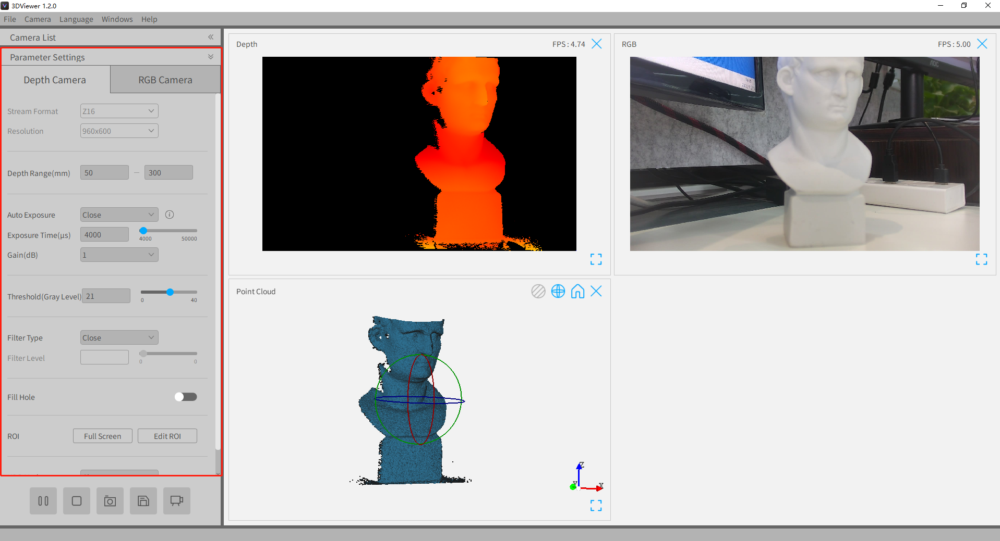

#### ROI设置

ROI只在存在深度图时才是生效的，通过如下图参数设置中的ROI设置按钮“Full Screen”和“Edit ROI”来调整ROI位置

- Full Screen：点击该按钮，会设置ROI区域为（0， 0，1， 1），即深度图整个区域，并在深度图上显示ROI框，如下图显示
- Edit ROI：点击该按钮，会获取当前ROI值，然后在深度图上绘制与ROI值对应大小和位置的ROI框

| Full Screen                               | Edit ROI                            |
| ----------------------------------------- | ----------------------------------- |
|  | 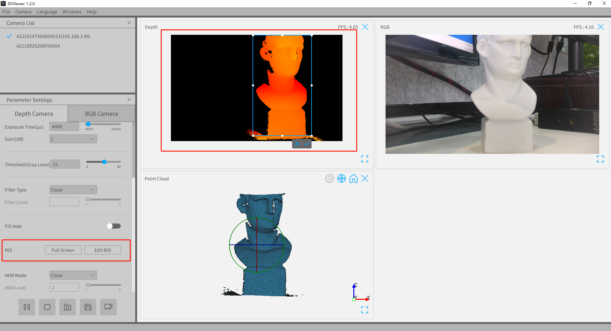 |

- 调整ROI框大小：鼠标左键移到ROI框四角或边框中部后按下，然后移动鼠标调整ROI大小；鼠标左键在ROI中部按下，然后移动鼠标调整ROI位置。
- 设置ROI：点击ROI框右下角的“✔“按钮。
- 隐藏ROI框：点击ROI框右下角的”✖“按钮。

#### HDR设置

HDR设置在深度参数设置最底部，主要分为设置HDR模式、设置HDR等级、自定义设置。

- 设置HDR模式：HDR模式共分为Close（关闭）、Shiny（高光模式）、Dark（黑色模式）、Both（复合模式）、Manual（手动模式，即自定义模式），默认为关闭模式，在”HDR Mode“的下拉框内切换不同HDR模式。
- 设置HDR等级：可以调整”HDR Level“中的输入框或滑动条调整HDR等级，等级设置越高，帧率越慢。
- 自定义设置：当将HDR模式设置为”Manual“时，可以在如下图HDR设置中的表格内手动调整曝光时间和增益，然后点击”OK“按钮设置HDR模式下的多组曝光时间和增益。

### RGB相机参数

RGB相机各个参数设置只影响RGB图和点云贴图情况，不影响其他图像显示，各个参数设置如下：

- Stream Format（格式）：RGB相机流格式分为RGB8、MJPG，预览模式不能切换流格式，只有在停止流或者暂停流状态下才能切换；
- Resolution（分辨率）：分辨率的大小，决定图像显示比例，与流格式一起决定一帧RGB数据的大小；
- Auto Exposure（自动曝光）：自动曝光开启后，曝光时间和增益手动调节被禁用，曝光时间和增益值由相机系统自动设置，随环境动态变化；
- Exposure Time（曝光时间）：在自动曝光开启状态下，手动设置曝光时间呈灰色禁用状态，调节曝光时间会影响图像的质量和帧率；
- Gain（增益）：在自动曝光开启状态下，手动设置增益呈灰色禁用状态；调节增益会影响图像质量，增益越大，噪声越大，增益调节不影响图像帧率；
- Auto White Balance（自动白平衡）：自动白平衡开启后，手动设置白平衡被禁用，白平衡数值由相机系统自动设置，随环境动态变化；
- White Balance（白平衡）：在自动白平衡开启状态下，手动设置白平衡呈灰色禁用状态；未开启时，可以手动输入白平衡值或者调节滑动条，以获取最理想最真实的图像效果。

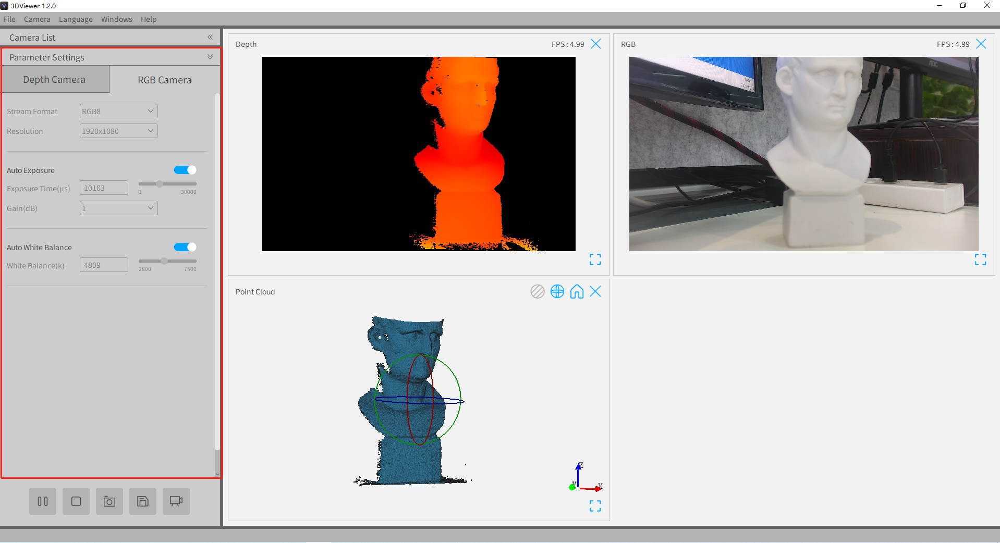

## 相机设置

### 重启相机

如下图，点击”Camera“菜单中”Restart camera“菜单项，相机将重启系统，大概需要25-45秒左右，请耐心等待，相机重启后会自动连接相机，需要手动启动预览才能进入预览模式。（注意”Camera“菜单在相机没有连接情况下是禁用的）

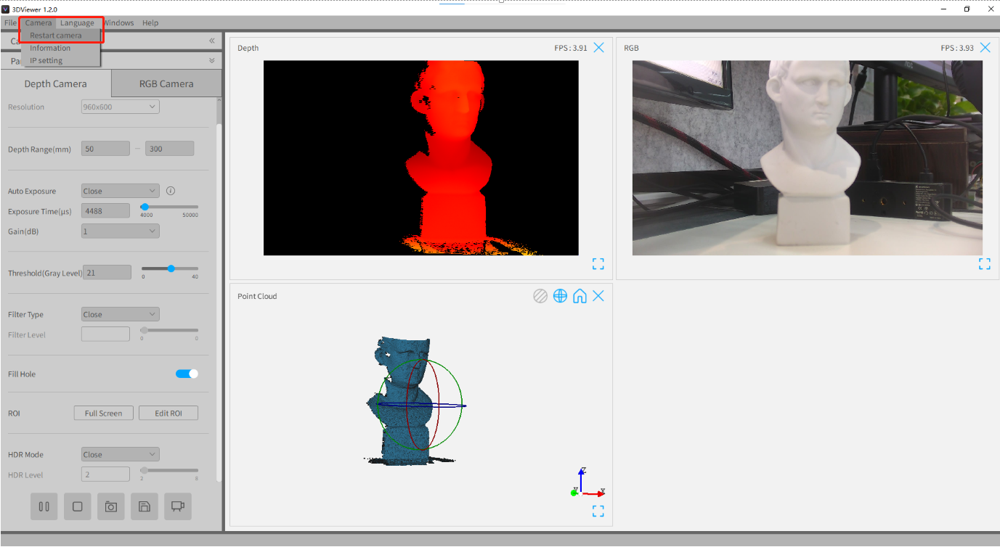

### 查看相机信息

如下图，点击”Camera“菜单中的”Information“菜单项，将弹出”Camera Info“弹出框，显示Model（机型）、Serial Number（序列号）、SDK Version（SDK版本号）、Firmware Version（固件版本）、Algorithm Version（算法版本）、Connect Mode（连接方式）等信息。相机信息在相机连接后才能查看。

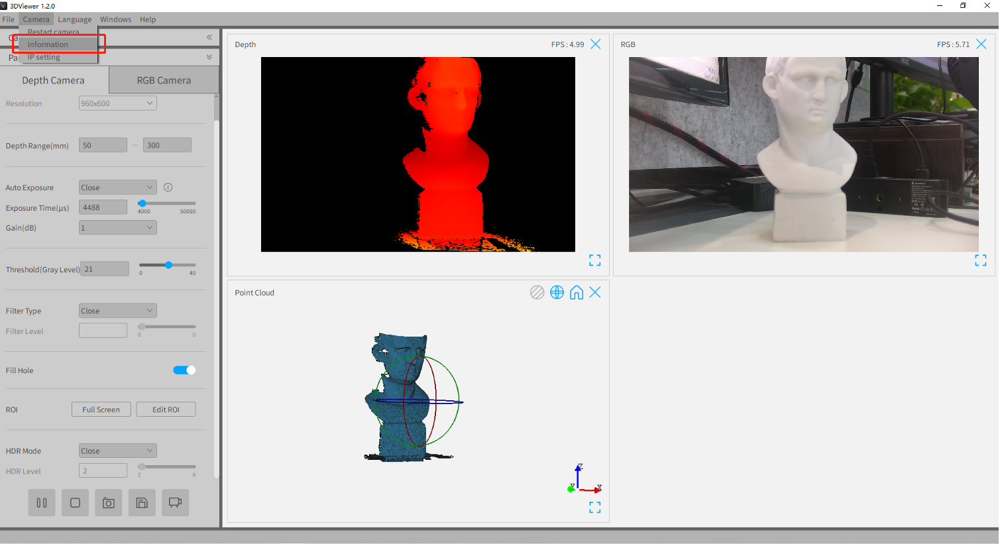

### IP设置

如下图，点击”Camera“菜单中的”IP Setting“菜单项，将弹出”IP Setting“弹出框，用于修改相机IP设置。

- 修改IP：修改IP地址只在相机工作手动IP模式下才生效，如下图，修改输入框IP地址，然后点击”Apply（应用）“按钮，修改IP后，需要重启相机才这真正生效。
- Mode设置：模式设置中分为”Manual（手动）“和”Auto（自动）“两种模式，手动模式下可修改IP地址，自动模式下，相机IP地址自动分配。

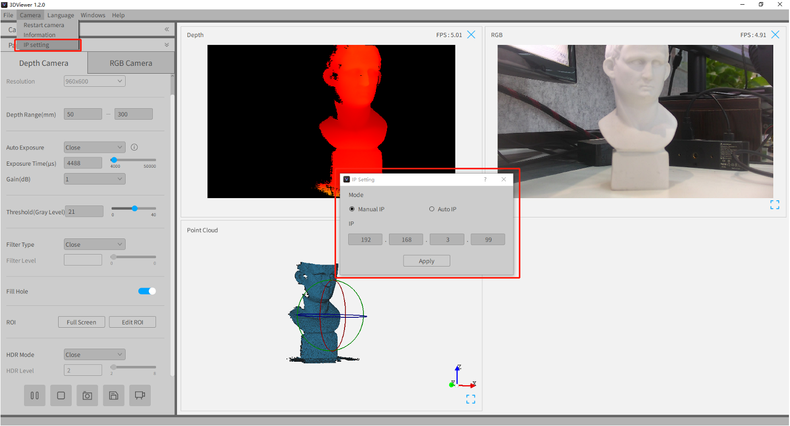

## 图像显示页面

### 切换显示布局

图像和点云可显示为”Tile（平铺）“和”Tabs（选项卡）“两种不同的布局，如下图，在”Windows“菜单下的”Layout“子菜单中完成切换。

| Tile（平铺）布局                       | Tabs（选项卡）布局                     |
| -------------------------------------- | -------------------------------------- |
| 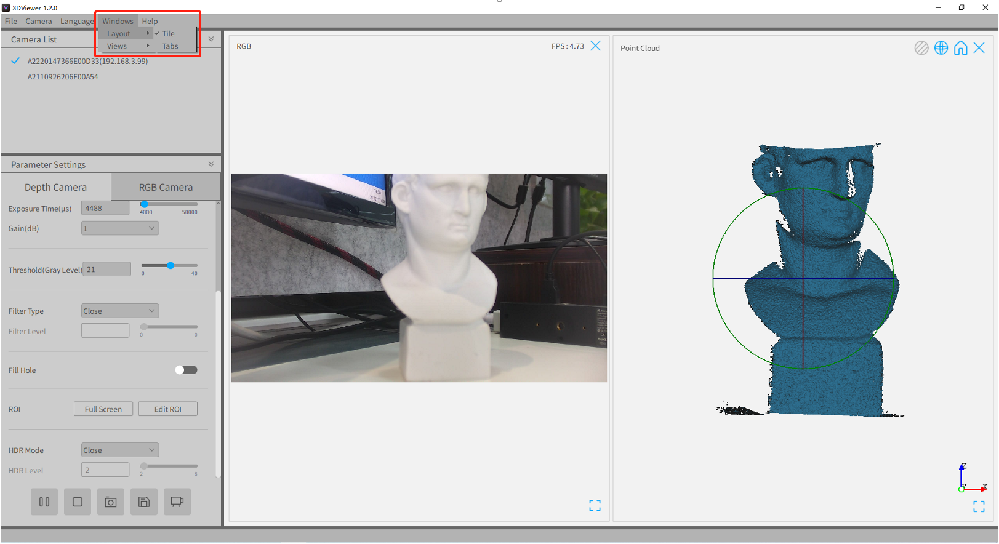 |  |

### 隐藏/显示单个窗口

若某个窗口图像不是我们关注的，可以隐藏该窗口，隐藏窗口方式有两种：

1. 在Tile显示布局下，点击图像右上角的”✖“按钮；
2. 点击”Windows“菜单-->Views子菜单，在菜单项中点击需要隐藏的窗口名称。

隐藏的窗口需要再次显示，点击”Windows“菜单-->Views子菜单，在菜单项中点击需要显示的窗口名称。

| 隐藏窗口                                        | 隐藏/显示窗口                     |
| ----------------------------------------------- | --------------------------------- |
|  |  |

### 进入/退出全屏

进入/退出全屏只在Tile显示布局才生效，若觉得Tile布局下显示的图像窗口太小了，如图点击图像右下角的全屏按钮，图像显示区域将只显示该图像，其他窗口隐藏，利于观察图像的细节；若需要退出全屏状态，点击全屏显示图像右下角的退出全屏按钮，将恢复全屏之前的状态。

| 进入全屏                               | 退出全屏                                   |
| -------------------------------------- | ------------------------------------------ |
|  |  |

### 2D图像显示放大

为了查看图像某部分细节，可以通过鼠标点击2D图像，然后按住Ctrl按键的同时滚动鼠标滚轮实现图像放大显示。

注意：

1. 该操作只在2D显示窗口生效，点云不生效；
2. 该操作在Tile显示布局下，在图像全屏显示下才生效，非全屏显示下不生效。

### 在深度图显示点信息

查看深度图上的点信息，只需要鼠标左键点击深度图上需要查看的位置，如下图，左下角标记2处将显示Depth Scale（深度缩放系数）和当前点的XYZ坐标。

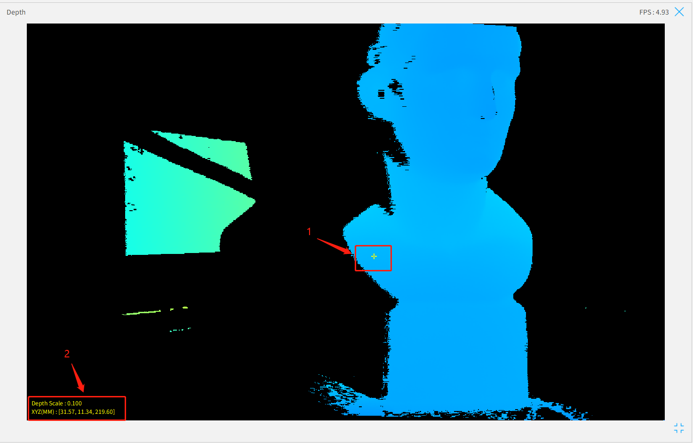

### 点云显示设置

#### 归位

如下图，点击点云显示右上角的归位按钮，点云图像将回归到最初位置和状态。

#### 隐藏/显示纹理

如下图，想查看带贴图的点云，可以点击点云右上角的打开纹理图标按钮，若不想显示贴图，再次点击该按钮关闭纹理（注意，若设备不存在RGB相机，点云图没有贴图，点云窗口右上角也不显示打开/关闭纹理按钮）。

| 不带贴图点云                           | 带贴图点云                                    |
| -------------------------------------- | --------------------------------------------- |
| 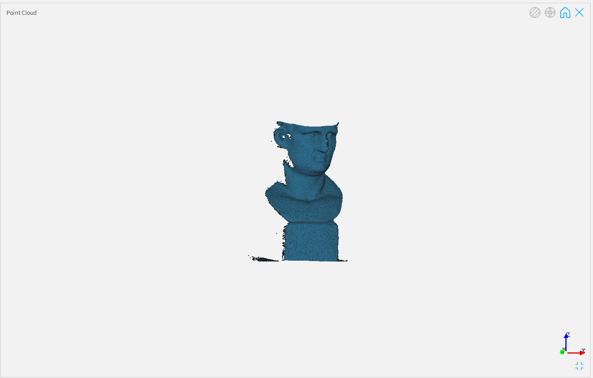 |  |

#### 隐藏/显示轨迹球

轨迹球标记着点云的旋转中心，如下图，隐藏/显示轨迹球可点击点云右上角图标按钮。

| 不显示轨迹球                           | 显示轨迹球                            |
| -------------------------------------- | ------------------------------------- |
|  |  |

## 单次触发

- 进入单次触发模式：如下图所示，点击标记2的图标按钮，进入单次触发模式后，底部状态栏提示”Entered single shot mode！You can click the button to get the next frame（已经进入单次触发模式！点击该按钮获取下一帧数据）“。此时图像显示窗口图像不再更新，获取新数据需要手动点击”单次触发“按钮，点击一次获取一次新数据。
- 退出单次触发模式：如下图2，进入单次触发模式后，点击标记2图标按钮，将退出单次触发模式，切换为持续出流模式。

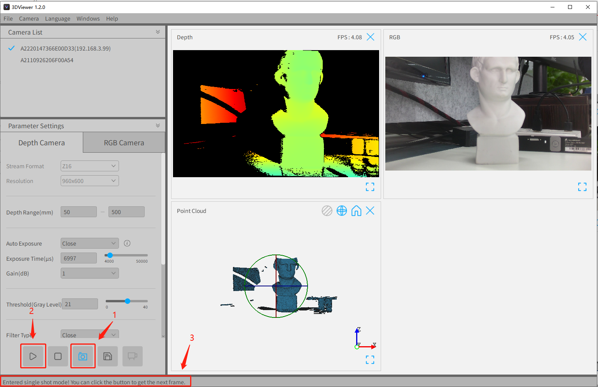

- 获取新一帧数据：进入单次触发后，获取一帧数据需要再次点击”单次触发“按钮，每点击一次获取一次新数据。

## 采集数据

### 单帧采集

- 开启/关闭自动命名：在File菜单中的”Auto file Naming“子菜单中，如下图标记2，可以设置开启和关闭。若设置为开启，点击单帧采集后自动生成文件名称；若关闭，点击单帧采集后会弹出文件保存框，输入保存文件名称。
- 采集一帧数据：如下图，点击标记1按钮，将保存当前所有图像和点云数据。

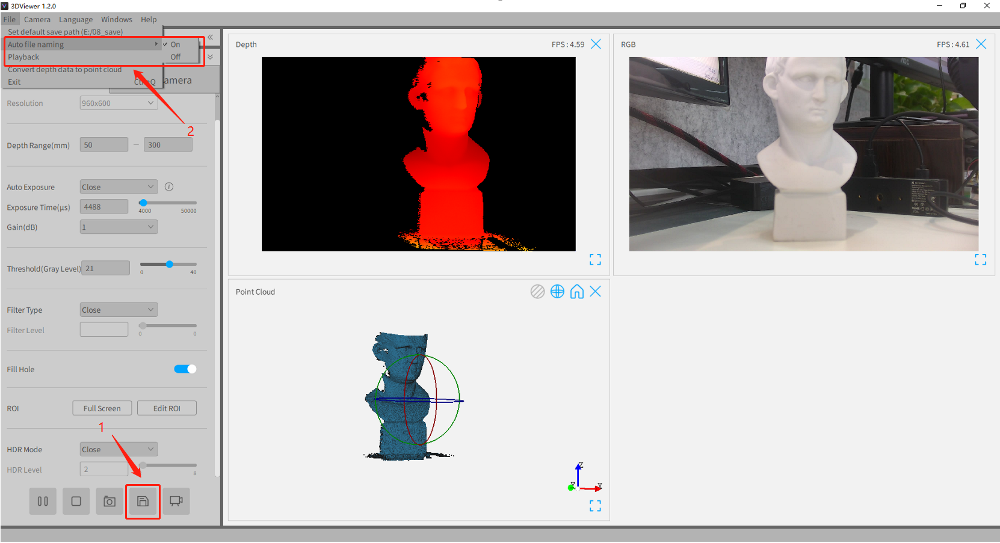

### 多帧采集

多帧采集功能可以保存连续的多帧数据，在Capture（采集）设置框内可以设置Frame Number（需要保存的帧数）、Data Type（需要保存的图像和点云数据）、Save Format（单帧存储的数据格式）。其中一帧点云数据存在一个.ply文件；在Save Format为images一帧图像数据存储为一个.png文件，Save Format为raw时一帧图像数据存储为一个.raw文件，最终将多帧存储的所有文件打包为一个.zip压缩文件。多帧采集操作如下：

1. 点击如下图标记的多帧采集按钮；

2. 在如下图标记2的采集设置框内修改相关的设置；

   

3. 点击采集设置框内的”Start“按钮，然后在弹出框文件保存框内输入保存名称；

   

4. 等待采集完成，如下图所示，看到左下角状态栏提示采集的帧数等于设置的帧数，所示采集完成了。

## 回放

对多帧采集得到的.zip数据，可以通过3DViewer进行手动播放，操作步骤如下：

1. 点击File菜单-->Playback；

   

2. 选择多帧采集的.zip文件；

   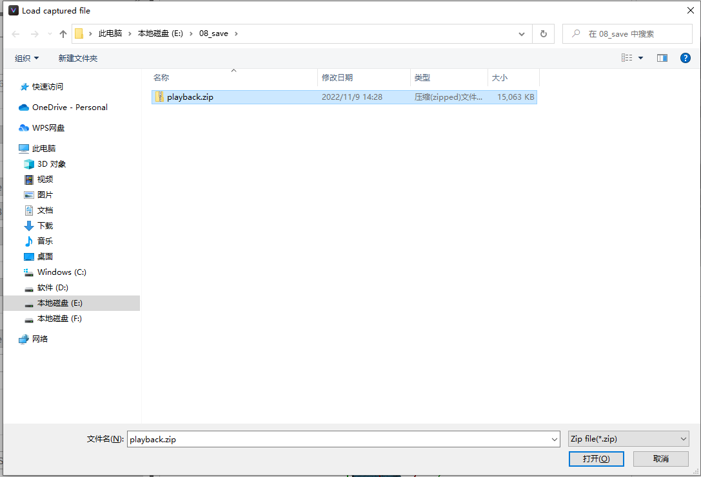

3. 导入成功后，将弹出如下弹出框；

   

4. 切换显示窗口：如下图标记1，点击复选框切换需要显示的窗口；

5. 手动播放：如下图标记2，在输入框输入需要显示帧序号或者调整滑动条调节需要显示的帧；

6. 保存当前帧：如下图标记3，点击保存按钮，保存当前显示的帧数据。

## 将深度数据转化为点云数据

对于多帧采集中保存的.zip数据，可以通过3DViewer中的批量转换功能，将深度图数据转化为点云数据，具体操作步骤如下：

1. 点击File菜单-->Convert depth data to point cloud;

   

2. 点击”Select source file“右侧的”Browse“按钮，选择多帧采集的.zip文件；

3. 点击”Select output directory“右侧的”Browse“按钮，选择转换输出目录；

   

4. 点击”Convert（转换）“按钮，进行批量转换；

   

5. 等待转换完成，看到如下图提示表示转换完成。

   

## 切换语言

点击”Language“菜单，然后点击需要切换的语言（目前仅支持英文和中文两种）。

## 帮助

了解更多关于3Dviewer的信息，可以点击”Help“菜单，包含内容如下：

- Manual（使用手册）：点击该菜单项，打开3DViewer使用手册；
- Github：点击该菜单项，使用本地浏览器打开3DViewer在github的仓库地址；
- Web Site：点击该菜单项，使用本地浏览器打开公司官网；

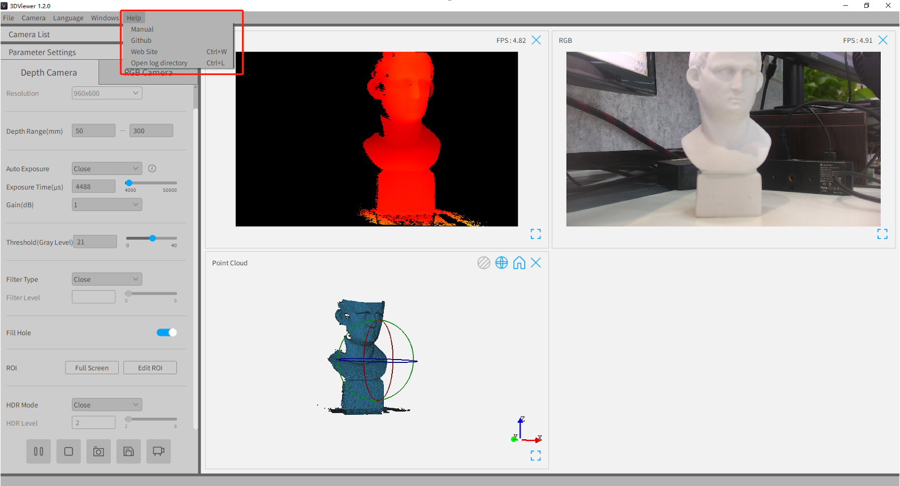

- Open log directory：点击该菜单项，打开3DViewer日志存储目录，如下图，其中sdk.log为3DCamera库的日志；3DViewer.xxxxx.log为3DViewer程序日志。

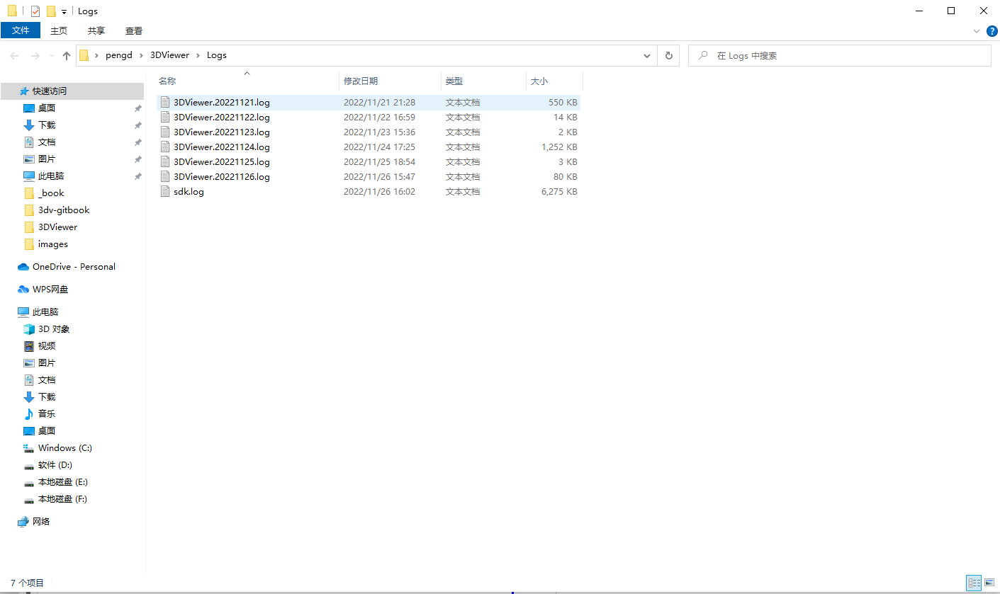

