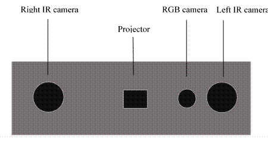

## 术语

- **3D相机**：可以获取物体三维点云和RGB颜色的相机，如下图：

  

- **深度流**：3D相机采集到的深度值数据流；

- **RGB流**：RGB彩色相机采集到的数据流；

- **Z16流**：16bit深度图像输出格式，图像上每点深度信息用16bit无符号整形表示，深度值*Scale得到毫米单位的距离，Scale可从设备属性中获取；

- **Z16Y8Y8流**：16bit深度图像+左右相机红外图像输出格式，1byte ~ 2 \* width \* height byte 为深度图像，(2 \* width \* height + 1 )  byte ~  3 \* width \* height byte 为左相机红外图像，(3 \* width \* height + 1 )  byte ~  4 \* width \* height byte 为右相机红外图像；

- **Pair流**：左右相机红外图像输出格式，1byte ~ width \* height  byte 为左相机红外图像，(width \* height + 1 )  byte ~ 2 \* width \* height byte为右相机红外图像；

- **RGB8流**：24bit RGB图像输出格式；

- **MJPG流**：RGB相机MJPG图像输出格式；

- **Point Cloud（点云）**：物体表面采样点的集合，每个点拥有在相机坐标系下的XYZ坐标；

- **FPS（帧率）**：Frame Per Second，画面一秒内输出的帧数；

- **深度**：测量点到相机坐标系XY平面的距离;

- **SDK**：软件开发工具包(Software Development Kit);

- **API**：SDK接口函数;

- **Depth Range（深度范围）**：深度可视范围，超出范围深度的物体不被相机捕获；

- **Exposure Time（曝光时间）**：曝光时间是指从快门打开到关闭的时间间隔；

- **Gain（增益）**：相机增益指图像亮度放大倍数，增益越大，亮度越大，噪声也越大；

- **Smooth Filter（平滑滤波）**：平滑滤波是低频增强的空间域滤波技术；

- **Median Filter（中值滤波）**：一种非线性平滑技术，它将每一像素点的灰度值设置为该点某邻域窗口内的所有像素点灰度值的中值；

- **Time Domain Smooth（时域滤波）**：

- **ROI（感兴趣区域）**：Region Of Interest，感兴趣区域。机器视觉、图像处理中，从被处理的图像以方框、圆、椭圆、不规则多边形等方式勾勒出需要处理的区域；

- **HDR**：（High Dynamic Range）高动态范围；

- **Auto Exposure（自动曝光）**：自动曝光是相机根据光线的强弱自动调整曝光量，防止曝光过度或者不足；

- **Auto White Balance（自动白平衡）**：自动白平衡通常为数码相机的默认设置，相机中有一结构复杂的矩形图，它可决定画面中的白平衡基准点，以此来达到白平衡调校；

- **White Balance（白平衡）**：白平衡的英文为White Balance，其基本概念是“不管在任何光源下，都能将白色物体还原为白色”，对在特定光源下拍摄时出现的偏色现象，通过加强对应的补色来进行补偿；

- **Depth Scale（深度缩放系数）**：深度流中深度值转化为实际距离（mm）的缩放系数；

- **软触发Soft trigger**：相机工作在待机模式，当软件触发（按钮点击、执行脚本或者调用软件接口）后实现拍照或者其它功能的行为；

- **外触发 External trigger**：相机响应外部输入触发信号进行采图，以实现和其他设备同步；

  